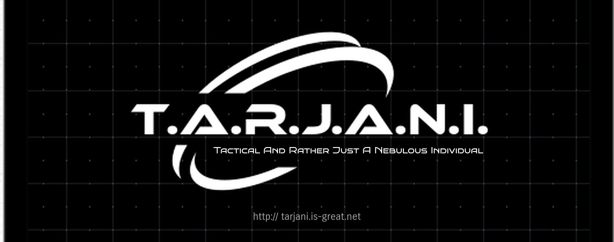

# T.A.R.J.A.N.I.

TARJANI, abbreviation of Tactical And Rather Just A Nebulous Individual, is a Virtual Assistant Software for Linux Systems. This software is a Machine Learning powered virtual assistant software which has
the ability to carry out user functions in the OS using text commands. The software is implemented in Python with a fully featured and a dynamic intent classifier and an entity extractor so that you can
even add your actions and teach TARJANI to perform your designed skills. This software is a CLI and a text based software for now. This project is still under development.  

# Note:
A demo repository has been created now which contains videos on the features of TARJANI and giving simple demonstration of its usage. You may find the demonstrations at [tarjani-demo](https://github.com/Rutvik-Trivedi/tarjani-demo).


# Update Notes:
TARJANI is improving constantly with each new updates. Check the [Changelog](#changelog) for more information on what's new and what has been fixed in each new updates

# Documentation

### Installation:
TARJANI is still under development. So, a working model of TARJANI is yet to be released. But if you are too curious, you can install the initial version of TARJANI and experiment it by creating your own scripts. Believe me, I have done most of your work. The present version of TARJANI contains a full featured dynamic intent classifier and an entity extractor. You can train your own intents with custom entities and create your own TARJANI skills. Your contributions are welcome. It will really help TARJANI improve. To install TARJANI, just clone this repository, install its dependencies and you are good to go! Run the following command in the terminal to install TARJANI :
```bash
git clone https://github.com/Rutvik-Trivedi/tarjani.git
```
After this, you just need to do the final setup by running the following commands :
```bash
cd tarjani/scripts
python3 complete_install.py
```
To check the download size of this repository as a single software and to avoid complexity and employ generalism, some of the mandatory models are provided separately for download. This situation may cause some errors in running the ```complete_install.py``` file for first time installation.  
In case an error is encountered, please follow the steps mentioned in the error and run the ```complete_install.py``` script again.  

Please raise an issue in case there might be any difficulty in installing the repository.

In case, the default NER model (named 'ner.tarjani', present in the 'model/nlu' folder) is missing, you can download the model from http://tarjani.is-great.net and place the model file in the 'model/nlu' folder.

### Updating TARJANI:
If you already have an installed version of TARJANI, please make a note that TARJANI is frequently updated and to keep up to date with the latest commit, you can update TARJANI by navigating to ```tarjani``` folder and running,
```bash
git pull origin main
```

### Run TARJANI:
To run TARJANI in an interactive mode, I have added a simple interaction script to query TARJANI according to the present model installed. For this, you may start interacting with TARJANI by running the following commands:
```bash
cd scripts
python3 interact.py
```
Moreover, you can also set the sensitivity of your model by passing the sensitivity as the argument as shown below:
```bash
python3 interact.py --sensitivity 0.5
# OR
python3 interact.py -s 0.5
```
The value of ```--sensitivity``` is between 0.0 and 1.0 (```float``` type). The default value is ```0.6```

# What are TARJANI skills?
_____
### Structure of an intent for TARJANI :
##### An intent in TARJANI has the following structure:
\
All the intents are stored in a main folder called 'intents'. The intents folder has a subfolder with the name same as the intent name. The subfolder has one mandatory file called 'intent.tarjani'. This file contains the information about the particular intent like the query phrases, the entity names and words, the responses, whether to call a webhook or not, etc. This file is used to train the intent classifier, the entity extractor, give responses and call webhooks.
\
\
There are other optional files in this subfolder called 'entity.tarjani' and 'skill.py'. The 'entity.tarjani' file saves the data of the entity extractor model for that particular intent if any entities are present. The 'skill.py' file is called if TARJANI has to carry out any local functions, as for instance, create a file, or to open some applications. The response from the interaction script (which is yet in development) will be passed to this 'skill.py' file as an argument and necessary processing will be done by TARJANI according to the content of the file. Thus, in essence, TARJANI skills are the abilities of TARJANI, or the works TARJANI is able to perform.


### How to create a TARJANI skill?
You can create a TARJANI skill by creating an intent for that skill and creating a skill.py file for that intent.
#### 1) Creating an Intent:
Creating an intent is really easy. You just need to run the following commands to start creating an intent:
```bash
cd scripts
python3 create_intent.py
```
And that's it! The intent creator will guide you through the steps of creating the intent in a detailed manner.  

##### Note:
The ```create_intent.py``` file will train the agent after every successful addition of an intent. In case this feels a little slow and repetitive for you, or you want to train the model only after creating several intents, you can skip the training by passing the ```train``` argument as belows:
```bash
python3 create_intent.py --train False  # Will only add the intent and not train the model
```
After creating your required number of intents, run the command,
```bash
python3 train_after_import.py   # Will train the agent based on existing intents
```

Moreover, you are in complete control over TARJANI. You can now even choose which model to train TARJANI on. in the present commit, you have two model options to train TARJANI on, LSTM model and CNN model. If you are not a programmer or you do not know much about what these models are, just forget about it as both are equally good and I have already implemented both the models for you. By default, the model will train on LSTM. But if you want to create your intent and train it on CNN, just run the following commands:
```bash
cd scripts
python3 create_intent.py --model cnn
## For CNN
python3 create_intent.py --model lstm
## For LSTM
```
#### 2) Import from KnowledgeBase (Yet Unstable):
This script is useful if you just want to use TARJANI as an FAQ bot and not as an assistant. To save you from creating individual intents for all questions manually, you can simply import your FAQs from a file and leave the intent creation to TARJANI. The supported file formats are ```.txt```, ```.json``` and ```.csv```. Entities, Webhooks and Variety of Response are not supported in this feature

You can import the KnowledgeBase by typing the following commands:
```bash
cd scripts
python3 import_knowledgebase.py
```

As I told you that you are in complete control, here also, you may choose to train TARJANI on a model of your choice:
```bash
cd scripts
python3 import_knowledgebase.py --model cnn
## Or
python3 import knowledgebase.py --model lstm   ## Default
```
You need to follow a particular file format for each knowledgebase file:
###### a) Text File (.txt):
- First line should start with the question
- The response to the question should be written in the line following the question
- Each question should have one and only one response
- There should be no blank lines in the document

##### b) JSON File (.json):
- The file should contain two keys named "query" and "response"
- The values should be both lists with the corresponding indexed values as the query and response
- There should be one and only one response per question
- There should not be any blank items in the list

##### c) CSV file (.csv):
- The file should contain two columns named "query" and "response"
- The corresponding values in each columns should be the query and its response
- There should be only one response for each query
- There should not be any blank rows in the file

You can view/download a sample KnowledgeBase file in [Text format](http://tarjani.is-great.net/examples/example.txt), [CSV format](http://tarjani.is-great.net/examples/example.csv), and [JSON Format](http://tarjani.is-great.net/examples/example.json)


#### 2) Create skill.py:
skill.py can be created according to the requirement of the skill. You may refer to an example skill.py by immporting a Pre Built example model of TARJANI. For that, you will need to download the model file from http://tarjani.is-great.net
\
At present, only two models are available for download, but more models are coming soon
\
Copy this model file in the scripts folder and run the import model script by running the following commands:
```bash
python3 import_model.py --name [model_name_without_extension] --model [model_name]
## Default model name is 'lstm'
```
Here, after the script executes, in the intents folder, you will find the new intents of the imported model. Here, in these intents, there will be a pre-implemented skill.py file wherever applicable. You may refer to this file format for developing new skills. Clearer documentation will be updated soon after the sufficient development of teh project.
#### 3) Exporting your model:
You can also export your model to publish it or for your personal use. For this, create you model by creating your requirement-specific skills and run the following commands to export it:
```bash
python3 export_model.py --name [name_for_your_model]
```
Contributions are welcome to create and publish new models and help improve TARJANI
#### 4) Deleting an Intent:
In case you want to delete an intent for some reason, you just need to run the following command:
```bash
python3 delete_intent.py
## Or
python3 delete_intent.py --model cnn   # Default : lstm
```
You can skip the training process after deleting the intent by using,
```bash
python3 delete_intent.py --train False
```
and it will guide you through deleting the intent. You just need to input the name of the intent to delete.
#### 5) Editing an existing intent:
To edit an existing intent, run the command:
```bash
python3 create_intent.py --edit True
# You can use the model parameter here also
```
By default, the ```--edit``` flag is set to ```False```, so by default, this script will run in create mode.
#### 6) Resetting an existing model:
To reset an existing model and remove all intents except the two default intents, i.e. welcome and fallback, run the following commands:
```bash
cd scripts
python3 reset_model.py
## Reset model only allows resetting the model on lstm
```

### Submitting a feedback:
Your feedback is really important for TARJANI to improve. You can submit your feedback, suggestions or issues directly by running the following commands:
```bash
cd scripts
python3 submit_feedback.py
```
Alternatively, you can also visit http://tarjani.is-great.net and submit a feedback there and help TARJANI improve  


# __Important Notice for Users__:

__***Please read this notice carefully before using TARJANI***__  

To improve the working process of TARJANI and to make TARJANI compatible and adjustable to every users, it is important that the accuracy of TARJANI is very good. And I, as a developer can not think in every possible way a user frames their query. So, to facilitate solving this process and in turn improve your experience as a user, TARJANI will log the queries which you are entering to the servers so that it will help me know the different types of queries the users can create and ask TARJANI. This will help me improve TARJANI to a great extent. __Please be aware that ONLY THE QUERIES YOU ENTER IN THE INTERACTION SCRIPT will be logged to the servers. NO PERSONAL INFORMATION OF ANY TYPE is collected using the script__. Still, you are in complete control over this logging process. If you do not want to contribute to the developement of TARJANI through sending your interaction queries, it is completely fine. You can use TARJANI without any type of server connections completely offline. For this, you will just need to remove the post call command in the interaction script and TARJANI will not log the queries to the servers. So, by using the interaction script without removing the logging script, you accept to share your completely anonymous usage information to help improve TARJANI. Accepting this will help TARJANI improve a lot. As the developer of this software, I thank all the users of this software to help me improve this project. Please feel free to contact me in case of any queries, suggestions or feedbacks. Thank you very much for your contributions.

# Changelog

### What's New?
- A major update is on its way! Now you can add your own models with minimum coding required! Just inherit the base class and its done! Documentation coming up soon
- Added simple demonstration videos showing how to use TARJANI. Available at [tarjani-demo](https://github.com/Rutvik-Trivedi/tarjani-demo).
- Added a new classifier model. Now TARJANI knows what an ALBERT + SVM model is. The keyword to use this model is 'albert'. You will need to download this model from [tarjani-model-zoo](https://github.com/Rutvik-Trivedi/tarjani-model-zoo)
- Refactored the structure of the files. Added some experimental vision features. Refer [the documentation](scripts/experimental/README.md) for full documentation.
- Created a dedicated repository for all the addon models at [tarjani-model-zoo](https://github.com/Rutvik-Trivedi/tarjani-model-zoo)

### Fixes
- Added more intuitive warnings for users and improved usability

Please do let me know if you encounter any bugs in the software. Your feedback shall help TARJANI improve a lot.

### Further Work:
- At present, followup intents creation and application is not yet supported. Further work shall include adding support for followup intents
- As TARJANI has just been started as a project, a limited number of pre-built models are available. Further improvement shall include adding more models to this list.
- Add support for more file formats for KnowledgeBase import
