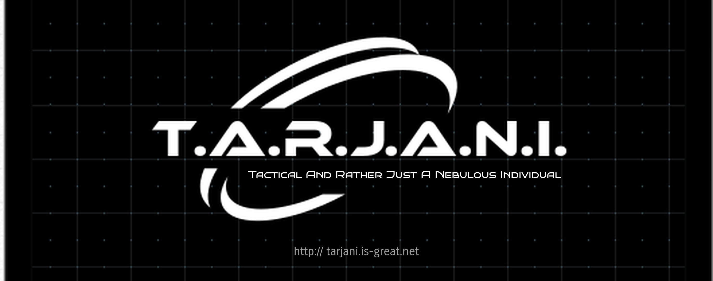

# Experimental Features

Guess what?! TARJANI has got a few new interesting and experimental features!
Now, along with text intelligence, TARJANI has also got a new set of vision features as well!
It is always amazing to see the world with our own eyes! She is one of a kind, don't you agree?


# Documentation

Before using these features, please make a note that these features are yet experimental and are yet being updated daily, hence may not have expected results, and also may have some bugs (due to continuous development). So please use it accordingly.

# Installation:
TARJANI is completely offline. To facilitate this, the models (trained as well as untrained) need to be hosted on your system. But, hese models tend to be a bit heavy in size and hence, I have configured TARJANI in a way which enables the users to download only the models which you as a user choose according to your requirements. Hence, the models are not included in the TARJANI installation. You will have to download the models separately which will prevent download of unnecessary models to your system. For downloading and installing the models, please visit the [TARJANI Model Zoo](https://github.com/Rutvik-Trivedi/tarjani-model-zoo) repossitory for detailed documentation.

## Image Captioning:
TARJANI can now understand images while in interactive mode. You can use this feature to convert the images to text and then use the text as the input to TARJANI as a query to make TARJANI understand images as well. Any new dependencies to install for it? Only one! That is the standard Python library for Computer Vision, OpenCV. It was necessary as most Computer Vision applications would require it. Did not install the dependencies yet? Here are the steps to install the dependencies:
```bash
git clone https://github.com/Rutvik-Trivedi/tarjani.git
cd tarjani
pip3 install -r requirements.txt
```
In case, the default NER model (named 'ner.tarjani', present in the 'model' folder) is missing, you can download the model from http://tarjani.is-great.net and place the model file in the 'model' folder.
If not already done, you also need to untar the GloVe Embedding file present in the "glove" folder. After the installation of the dependencies, you are ready to experiment with TARJANI.

Let's get to the usage now!
The image captioning feature can be used from the bash as well as using Python API.
##### 1) Using Bash:
```bash
cd experimental    # This is the folder where all experimental features are available
python3 vision.py --path path/to/image/
# This should print out the caption corresponding to the image
```
##### 2) Using Python API:
```python
from experimental.vision import understand_image
print(understand_image(image='path/to/image'))
```
##### 3) Print information about the module:
```python
from experimental.vision import info
info()
```

## Face Recognition:
What better feature than TARJANI recognizing you? Or someone you know? Well, another feature up the sleeves of TARJANI. Again, please note that these features are experimental and hence requires improvement. They may even be discontinued in case of low performance. For that, I request you to provide your feedback through the feedback script or visiting http://tarjani.is-great.net

##### 1) Add your Reference Image:
TARJANI will require one reference image of yours to recognize you. The image will be stored in an encoded format and will not be accessible in its original format. For doing this, get one image (having only your face, or else, might confuse TARJANI). To process the reference image, run the following:
```python
from experimental.face_recognition import Recognizer
recognizer = Recognizer()
recognizer.add_image('path/to/image.jpg', 'Your_Name_Goes_Here')
```
This will add a file named ```Your_Name_Goes_Here.npy``` in the ```data``` directory. This is your image in the encoded format. This will also remove the original image automatically after processing. If you want to keep the original image as it is, run,
```python
recognizer.add_image('path/to/image.jpg', 'Your_Name_Goes_Here', delete_original=False)
```
Now, TARJANI will be able to recognize you! You can add as many faces as you like! Different people each!
##### 2) Recognizing Face:
Please make sure to add a reference image first for TARJANI to be able to recognize your face.
Run the following API to recognize face from an image,
```python
from experimental.face_recognition import Recognizer
recognizer = Recognizer()
print(recognizer.evaluate('path/to/image.jpg'))
```
You can also set the threshold of decision for the model. Less the margin, stricter the model. Default value is ```0.18```. Feel free to experiment with different values and see which fits best,
```python
from experimental.face_recognition import Recognizer
recognizer = Recognizer()
print(recognizer.evaluate('path/to/image.jpg', threshold=0.2))
```
##### 3) Remove a Reference Face:
To disable TARJANI recognizing a face, run,
```python
from experimental.face_recognition import Recognizer
recognizer = Recognizer()
recognizer.remove_image('Your_Name_Goes_Here')
```
and it will remove the reference image from the ```data/``` directory. Alternatively, you may simply delete the ```Your_Name_Goes_Here.npy``` file to remove the image
##### 4) Print information about the module:
```python
from experimental.face_recognition import Recognizer
recognizer = Recognizer()
recognizer.info()
```

# Contributing
Contributions are always welcome! Your contributions will help TARJANI improve a lot. Please open a pull request or provide your feedback on TARJANI.
